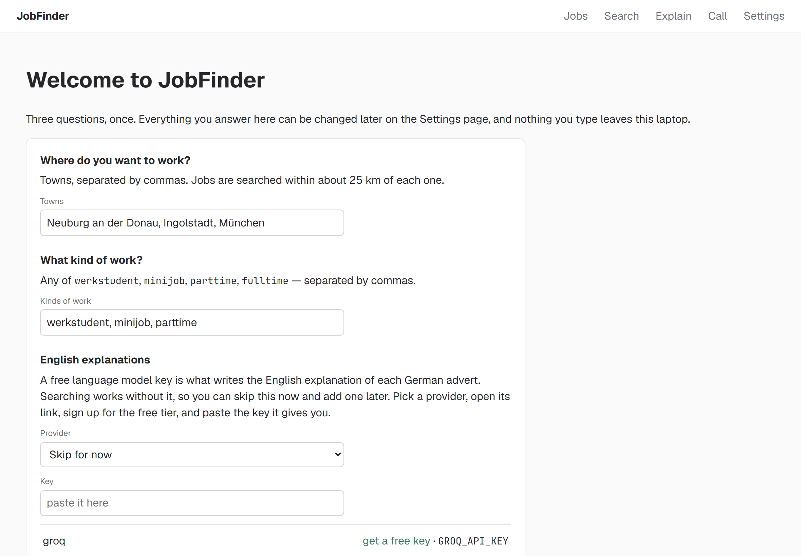
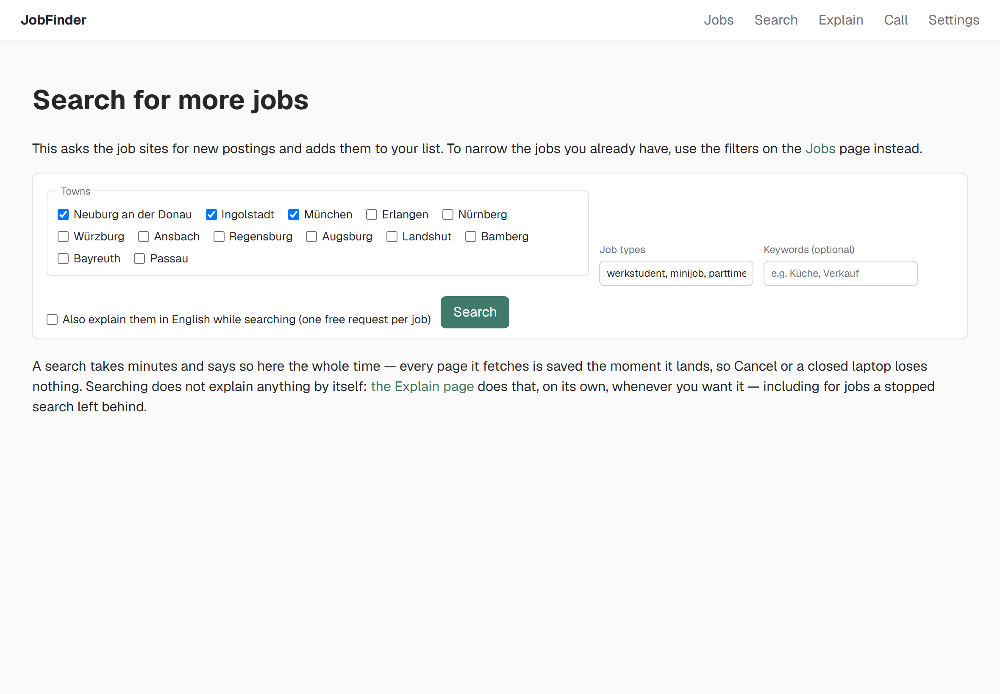
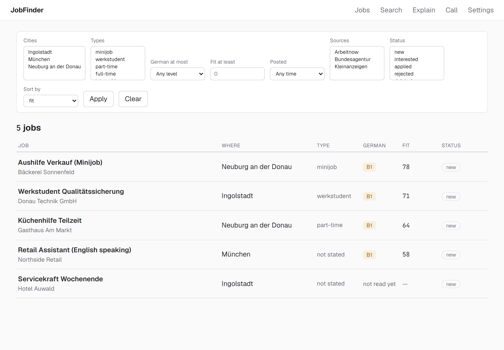
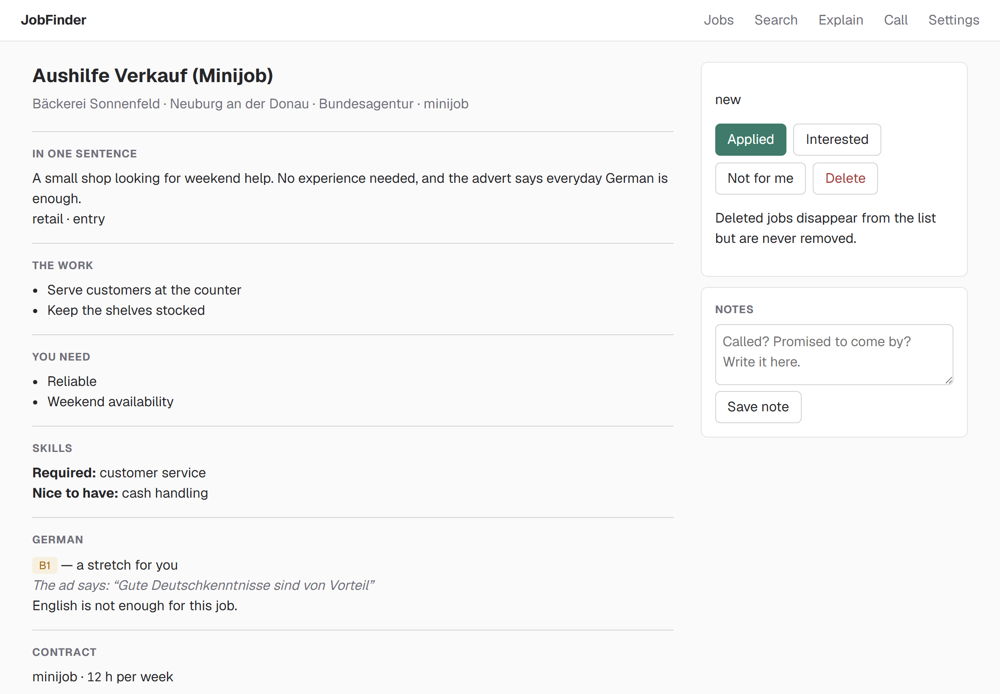
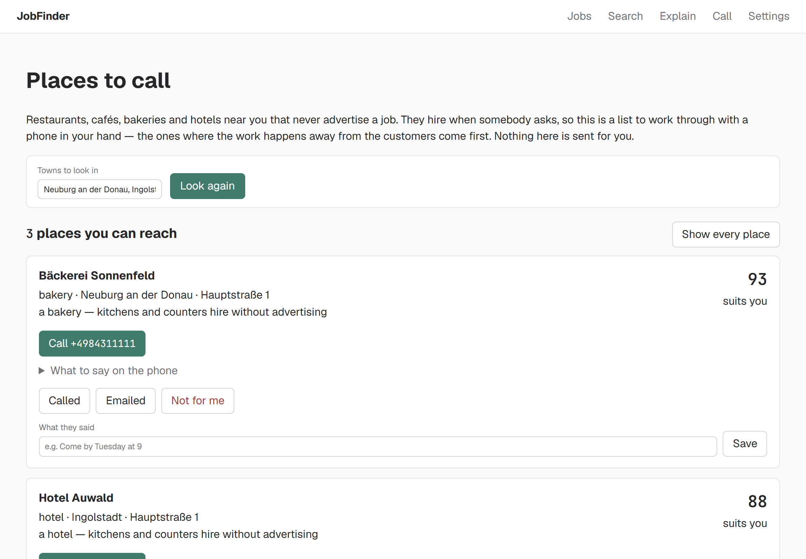
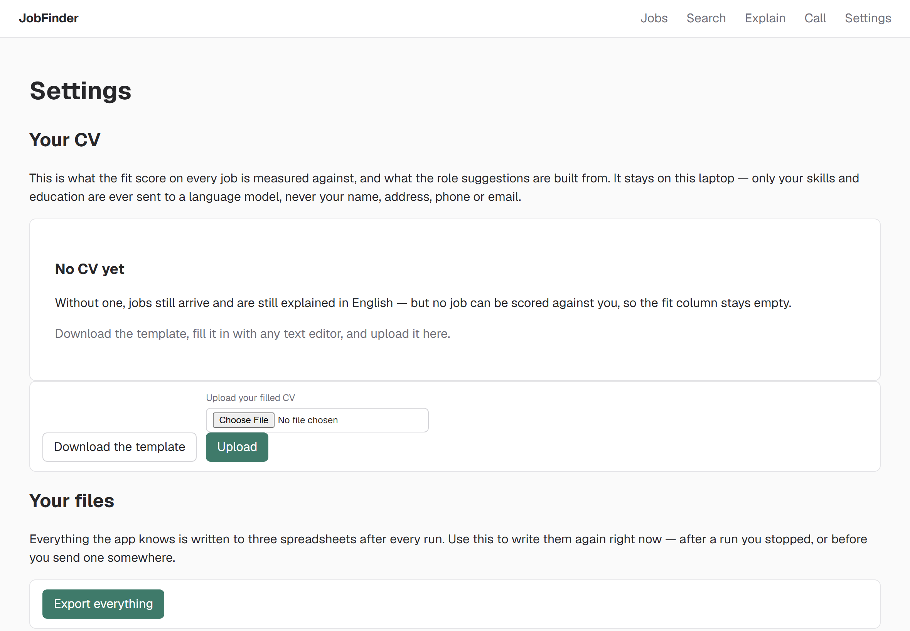

# JobFinder

A job search that runs on your own laptop. It collects part-time and student
jobs from several German job sites, explains each German advert in English, and
keeps a list of local places worth ringing even when they have not advertised
anything.

Nothing you put into it leaves your laptop: your CV, your notes and the jobs you
have marked are files in one folder, and no one else can see them.

## Starting it

Double-click **JobFinder.exe**.

A small black window opens and stays open — that window *is* the app running, so
leave it alone while you work. Your browser opens by itself a second later. If it
does not, the black window shows an address beginning with `http://127.0.0.1`;
type that into your browser.

To stop JobFinder, close the black window.

## The first time: three questions

- **Where do you want to work?** Towns, separated by commas. Each is searched
  within about 25 km, so a nearby town brings in the villages around it.
- **What kind of work?** Any of `werkstudent`, `minijob`, `parttime`,
  `fulltime`, separated by commas.
- **English explanations.** If the page says *Ready — nothing for you to do
  here*, the app already has the keys it needs and you can ignore this part
  entirely. If instead it asks for a key: that key is what writes the English
  explanation of each German advert, searching works perfectly well without one,
  and you can pick *Skip for now* and add one later on the Settings page.

Press **Save and start**. You will not be asked these again.

## The five pages

Along the top: **Jobs**, **Search**, **Explain**, **Call**, **Settings**.

### Search — finding new adverts

Press **Search** and leave it running. It asks several German job sites, one
page at a time, politely — a full run takes a few minutes. The panel counts what
it has found as it goes.

You can stop it at any moment with **Cancel**, and nothing already found is
lost. The same is true if the laptop goes to sleep or the window is closed: every
advert is saved the second it arrives, and the next search carries on rather than
starting over.

### Jobs — everything found so far

The list of everything collected. The filters along the top narrow it: town,
kind of work, how much German the advert asks for, how well it fits you, and how
recently it was posted. **Fit** is a score out of 100 comparing the advert with
your CV — higher is a closer match.

Adverts nobody has seen in two weeks are greyed out. They are usually gone.

### One job

Everything the advert says, in English: what the work is, what they ask for, how
much German it needs and where that was said, and how to apply. The German
original is on the same page, folded up — open it before you write to anyone,
because that is the text they wrote.

Three buttons: **Applied**, **Not for me**, and a place for your own notes. All
three are remembered, including after JobFinder is closed.

### Explain — the English versions

Adverts arrive in German. Explaining them is a separate press, because each one
costs one free request to the language model provider, and the free tiers are
small. The page says how many are waiting and how many it will do, before it does
anything. Fifty at a time is a good rhythm.

Pressing it again continues where it stopped. Nothing is ever explained twice.

### Call — places that never advertise

Most small bakeries, cafés, hotels and restaurants never post a job anywhere.
They hire the person who walks in and asks. This page is a list of them near your
towns, with their phone numbers, best-fit first.

Each one comes with a short script in German, with the English underneath each
line, so a phone call is five sentences you can read out. Mark each place
**Called**, **Emailed** or **Not for me** with a note, and it moves out of the
queue.

### Settings — your CV, your keys, your files

- **Your CV.** Download the template, fill it in, upload it back. It is what the
  fit score is measured against. Only your skills and education are ever sent to
  a language model — never your name, address, phone number or email. If the file
  has a mistake in it, the page says which line, and the CV you already had is
  left exactly as it was.
- **Suggested roles.** With a CV in place, JobFinder can suggest the German job
  titles worth searching for. Each one becomes a search with a single click.
- **Export everything.** Writes all three spreadsheets again, right now, and
  tells you where they are. They open in Excel.
- **Language model keys.** Which providers have a key, and where to get one for
  the ones that do not.

## Your files

Everything lives in a folder called `data`, beside `JobFinder.exe`:

| File | What it is |
|---|---|
| `jobs-init.csv` | Every advert found, as a spreadsheet |
| `jobs-enriched.csv` | The English explanations, one row per job |
| `contacts.csv` | The call list, printable |
| `jobfinder.db` | Everything the app knows, including your notes and marks |
| `backups/` | A copy of all of the above, from each of the last five runs |

Copy that folder to a memory stick and you have everything.

## If something looks wrong

- **A page says it cannot do something.** Read the sentence — it says which one
  thing is missing (usually a key or a CV) and links to the page that fixes it.
- **"This laptop does not seem to be on the internet."** Exactly that. Reconnect
  and press the button again; nothing was lost.
- **A search found nothing.** If the page says every source failed, the sites
  were refusing requests — try again in a few minutes. If it says the filters
  matched nothing, widen them: an older posting date, or a lower fit.
- **The window says the ports are all in use.** JobFinder is probably already
  running. Look for its other window before starting a second one.
- **It looks stuck.** It is not: any wait longer than a second shows counts that
  keep moving. If they have stopped, close the window and start it again — the
  work already done is saved, and the next run continues from there.
- **Anything else.** Close the black window, open JobFinder again, and tell
  Milad what the screen said. Nothing you have marked, written or found can be
  lost by closing it.
